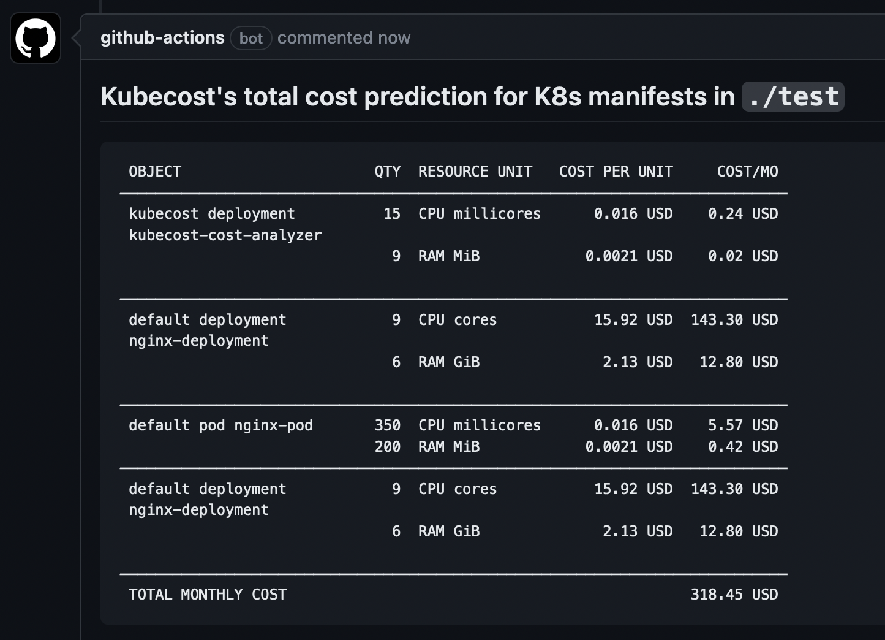

# Kubernetes Cost Prediction Action

Predict the cost of Kubernetes resource specs (manifests) in CI! Make cost decisions before
merging changes.

This is a GitHub Action, powered by [Kubecost](https://docs.kubecost.com/install-and-configure/install), to make cost predictions for K8s
workloads before they are applied to your cluster. It _does not_ require you to
have Kubecost installed, but will have highly-accurate cost and usage
information for your environment if you do.

In action:



## Usage

Add this Action as a step in one of your Actions workflows and point it at some
YAML files.

### Simple

Below is an excerpt from a workflow written with this Action. This is the
easiest way to add Kubernetes cost prediction to your CI.

``` yaml
- name: Run prediction
  id: prediction
  uses: kubecost/cost-prediction-action@v0
  with:
    # Set this to the path containing your YAML specs. It can be a single
    # YAML file or a directory. The Action will recursively search if this
    # is a directory and process all .yaml/.yml files it finds.
    path: ./repo

# Write/update a comment with the prediction results.
- name: Update PR with prediction results
  uses: edumserrano/find-create-or-update-comment@v1
  with:
    issue-number: ${{ github.event.pull_request.number }}
    body-includes: '<!-- kubecost-prediction-results -->'
    comment-author: 'github-actions[bot]'
    edit-mode: replace
    body: |
      <!-- kubecost-prediction-results -->
      
      ## Kubecost's total cost prediction for K8s YAML Manifests in this PR

      \```
      ${{ steps.prediction.outputs.PREDICTION_TABLE }}
      \```
```

### Advanced (full workflow)

This is a full Actions workflow file, with commented-out sections and
explanations highlighting advanced features and some complex use-cases.

``` yaml
name: Predict K8s spec cost
on: [pull_request]

jobs:
  predict-cost:
    runs-on: ubuntu-latest
    steps:
      # Check out the current repo to ./repo
      - uses: actions/checkout@v2
        with:
          path: ./repo
          
      # If using the API support, you need to make sure the Action runner has
      # network access to your instance of Kubecost. This is infra dependent;
      # the following example works with GKE (make sure to set up the necessary
      # secrets).
      # https://docs.github.com/en/actions/guides/deploying-to-google-kubernetes-engine
      # - name: Setup gcloud
      #   uses: google-github-actions/setup-gcloud@v0.2.0
      #   with:
      #     service_account_key: ${{ secrets.GCP_SA_KEY_B64 }}
      #     project_id: ${{ secrets.GKE_PROJECT_ID }}
      # 
      # Get GKE credentials so kubectl has access to the cluster
      # - name: Get GKE credentials
      #   uses: google-github-actions/get-gke-credentials@v0.2.1
      #   with:
      #     cluster_name: ${{ secrets.GKE_CLUSTER }}
      #     location: ${{ secrets.GKE_ZONE }}
      #     credentials: ${{ secrets.GCP_SA_KEY_B64 }}
      #     project_id: ${{ secrets.GKE_PROJECT_ID }}
      # 
      # - name: Forward the kubecost service
      #   run: |
      #     kubectl port-forward --namespace kubecost service/kubecost-cost-analyzer 9090 &
      #     sleep 5
      
      # If you use Helm, you should template the chart and then run the Predict
      # Action targeting the result. Here's an example of how to do that.
      # 
      # - name: Install helm
      #   run: |
      #     curl https://raw.githubusercontent.com/helm/helm/master/scripts/get-helm-3 | bash
      # 
      # - name: Helm template
      #   run: |
      #     helm template RELEASENAME ./repo >> ./templated.yaml

      - name: Run prediction
        id: prediction
        uses: kubecost/cost-prediction-action@v0
        with:
          log_level: "info"
          # Set this to the path containing your YAML specs. It can be a single
          # YAML file or a directory. The Action will recursively search if this
          # is a directory and process all .yaml/.yml files it finds.
          # 
          # If you use Helm, you probably want to run "helm template", output
          # to a path like ./templated.yaml, and set "path: ./templated.yaml".
          path: ./repo
          # Set this to either:
          # - localhost:9090/model if port forwarding OR
          # - The URL of your Kubecost instance if the runner has direct network
          #   access, e.g. "https://kubecost.example.com:9090/model"
          #
          # If unset, the Action will use Kubecost's default pricing to make a
          # prediction and it will be unable to make
          #
          # kubecost_api_path: "http://localhost:9090/model"

      # Write/update a comment with the prediction results.
      - name: Update PR with prediction results
        uses: edumserrano/find-create-or-update-comment@v1
        with:
          issue-number: ${{ github.event.pull_request.number }}
          body-includes: '<!-- kubecost-prediction-results -->'
          comment-author: 'github-actions[bot]'
          edit-mode: replace
          body: |
            <!-- kubecost-prediction-results -->
            
            ## Kubecost's total cost prediction for K8s YAML Manifests in this PR

            \```
            ${{ steps.prediction.outputs.PREDICTION_TABLE }}
            \```

      # Alternatively, you can just output the prediction in the Action log.
      # - name: output raw yaml prediction
      #   run: |
      #     echo "${{ steps.prediction.outputs.PREDICTION_TABLE }}"
```

### Inputs/Outputs

#### Action inputs

| Name | Description | Required? | Default |
|------|-------------|-----------|---------|
| `path` | The path of a file or directory that contains K8s YAML manifests to predict the cost impact of | Yes | |
| `kubecost_api_path` | URL of your Kubecost API. If provided, cost predictions will be a diff based on cost data tracked by your Kubecost instance. If not provied, cost predictions will be a total cost based on Kubecost's default pricing. | No | |
| `log_level` | The log level to run the Action with. Set to `debug` for more granularity or `warn` or `error` for less granularity. | No | `info` |

#### Action outputs

| Name | Description |
|------|-------------|
| `PREDICITION_TABLE` | An ASCII-formatted table of the cost prediction. Best rendered in monospace. |

## Limitations

The Action currently only supports predicting `.yml`/`.yaml` specs. If you have
specs in other formats, you will have to put them into YAML before running
prediction logic. E.g. for Helm, use `helm template`. More support planned,
please open an issue describing your use case if it is not yet supported.

The Action does not yet support prediction on only changed files.

## Development

Source code for the container is mostly closed. Kubecost engineers, visit
`cmd/costpredictionaction` in KCM for more information about development, testing, and releasing.
